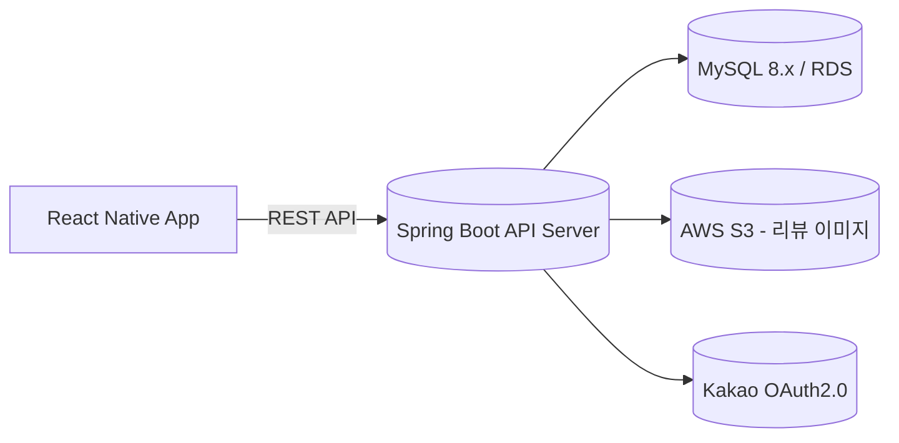

# UsFit – 운동으로 연결되는 우리

> **스포츠 시설 정보부터 동호회·용병 매칭까지 한 번에!**  
> 공공데이터와 커뮤니티 기능을 묶어 체육활동 참여를 촉진하는 통합 스포츠 플랫폼

---

## 주요 화면 (Screenshots)
(앱 주요 화면 캡처 추가 예정)

---

## 팀구성

<table align="center">
  <tbody>
    <tr>
      <th>Team Leader</th>
      <th>Team Member</th>
      <th>Team Member</th>
      <th>Team Member</th>
    </tr>
    <tr>
      <td align="center">
        <a href="https://github.com/gitIt-sehyeon">
          
          <br />
          <b>정세현</b>
        </a>
      </td>
      <td align="center">
        <a href="https://github.com/YoonB-dev">
          
          <br />
          <b>이윤형</b>
        </a>
      </td>
      <td align="center">
        <a href="https://github.com/kimtaeyeon04">
          
          <br />
          <b>김태연</b>
        </a>
      </td>
      <td align="center">
        <a href="https://github.com/BROWNIE-TARTE">
          
          <br />
          <b>안예준</b>
        </a>
      </td>
    </tr>
    <tr>
      <td align="center">
        <a href="" target="_blank">개인 리포트</a>
      </td>
      <td align="center">
        <a href="" target="_blank">개인 리포트</a>
      </td>
      <td align="center">
        <a href="" target="_blank">개인 리포트</a>
      </td>
      <td align="center">
        <a href="" target="_blank">개인 리포트</a>
      </td>
    </tr>
  </tbody>
</table>

---

## 프로젝트 개요

**UsFit** 백엔드는 Spring Boot 3 기반의 REST API 서버로 다음과 같은 도메인을 제공합니다.

- **시설 & 강좌**: 공공데이터 기반 시설/강좌 CSV를 배치로 적재하고, 위치·종목 조건으로 검색
- **동호회 커뮤니티**: 클럽 생성, 가입 승인, 멤버 역할/권한 관리, 강제 탈퇴/위임 등 운영 도구
- **용병 매칭**: 모집글 작성·조회, 신청/수락/거절, 내 모집글/내 신청 현황 조회
- **리뷰**: 시설·강좌 대상 리뷰 CRUD + AWS S3 이미지 업로드/삭제
- **회원 & 인증**: 자체 회원가입/로그인, Kakao OAuth2.0, Google(스텁), JWT 기반 보호 API, 사용자 프로필/관심 종목 관리

> **목표**: 체육시설 접근성을 높이고, 개인 → 커뮤니티 → 지역사회로 이어지는 건강한 운동 문화를 확산

---

## 백엔드 기능 맵

| 영역 | 주요 엔드포인트 | 설명 |
| --- | --- | --- |
| 시설(`FacilityController`) | `GET /api/facility/{id}` `GET /api/facility/search` `GET /api/facility/nearby` | 시설 상세·조건·반경 검색. 종목 필터링은 `SportRepository`와 연계 |
| 강좌(`CourseController`) | `GET /api/course/search` | `itemNm + 시/군/구` 조건으로 공공 강좌 조회 |
| 동호회(`Club*Controller`) | `POST /api/clubs` `GET /api/clubs` `GET/POST/PATCH/DELETE /api/club-info/**` | 클럽 생성, 멤버 역할 변경, 관리자 권한 부여/회수, 탈퇴/강퇴 등 운영 기능 |
| 가입요청(`ClubJoinController`) | `POST /api/club/{id}/requests` `GET /api/club/{id}/requests` `POST /api/club/join/requests/{id}/decision` | 가입 신청/승인/거절 및 중복 신청 방지 |
| 용병(`RecruitPlayer*Controller`) | `POST /api/recruits` `GET /api/recruits` `GET /api/recruits/me` | 모집글 CRUD (활성 상태, 내 글 조회) |
| 지원(`RecruitApplicationController`) | `POST /api/recruits/{postId}/applications` `PATCH .../{applicationId}` `GET .../me` | 신청/목록/상태 변경/내 신청 조회 |
| 리뷰(`ReviewController`) | `POST/PUT/DELETE /api/review` `GET /api/review` | 멀티파트 요청으로 리뷰 본문과 이미지 동시 처리, AWS S3에 업로드 |
| 사용자(`UserController`, `ProfileController`) | `POST /api/user/signup` `POST /api/user/login` `GET/POST /api/user/profile` | 회원가입/로그인/JWT 발급, 프로필(신체정보 + 관심운동) 업서트 |

OpenAPI(Swagger UI)는 `http://localhost:8080/swagger-ui/index.html`에서 JWT 베어러 인증으로 테스트할 수 있습니다.

---

## 인증 & 보안

- **JWT**: `JwtTokenProvider`가 `jwt.secret`, `jwt.access-token-validity-seconds` 값을 사용해 액세스 토큰 생성/검증
- **보안 필터**: `JwtAuthenticationFilter`가 `/api/user/login`, `/api/user/signup`, `/api/facility/**`, `/api/course/**` 등 화이트리스트를 제외한 모든 요청을 보호
- **OAuth**: `KakaoLoginHandler`가 auth code → access token 교환 후 사용자 upsert, `GoogleLoginHandler`는 토큰 연동 전까지 placeholder 로직
- **CORS**: `SecurityConfig`에서 `http://localhost:3000`, `http://3.27.134.2:8080` 도메인을 허용

---

## 기술 스택 (Tech Stack)

### Backend
   
   

### Database
  

### Security & Auth
  

### API & Docs
  

### 외부 연동
    

### Infra
   

### Build & Tools
        

---

## 시스템 아키텍처



---

## 프로젝트 구조

```
usfit-api/
├── src/
│   ├── main/
│   │   ├── java/app/usfit/api/
│   │   │   ├── club/                    # 동호회 도메인
│   │   │   │   ├── controller/         # 동호회 API 엔드포인트
│   │   │   │   ├── dto/               # 요청/응답 DTO
│   │   │   │   ├── entity/            # 동호회 엔티티 (Club, ClubMember, ClubJoin 등)
│   │   │   │   ├── repository/        # JPA Repository
│   │   │   │   └── service/           # 비즈니스 로직
│   │   │   │
│   │   │   ├── facility/               # 체육시설 도메인
│   │   │   │   ├── controller/        # 시설 검색 API
│   │   │   │   ├── dto/               # 시설 DTO
│   │   │   │   ├── entity/            # 시설 엔티티 (Facility, FacilityAddress 등)
│   │   │   │   ├── repository/        # 시설 Repository (위치 기반 검색)
│   │   │   │   └── service/           # 시설 검색 로직
│   │   │   │
│   │   │   ├── recruitplayer/          # 용병 매칭 도메인
│   │   │   │   ├── controller/        # 용병 모집 API
│   │   │   │   ├── dto/               # 용병 DTO
│   │   │   │   ├── entity/            # 용병 모집글 엔티티
│   │   │   │   ├── repository/        # 용병 Repository
│   │   │   │   └── service/           # 용병 매칭 로직
│   │   │   │
│   │   │   ├── sport/                  # 종목 도메인
│   │   │   │   ├── controller/        # 종목 API
│   │   │   │   ├── dto/               # 종목 DTO
│   │   │   │   ├── entity/            # 종목 엔티티
│   │   │   │   ├── repository/        # 종목 Repository
│   │   │   │   └── service/           # 종목 관리 로직
│   │   │   │
│   │   │   ├── user/                   # 사용자 도메인
│   │   │   │   ├── controller/        # 회원 API
│   │   │   │   ├── dto/               # 회원/프로필 DTO
│   │   │   │   ├── entity/            # User, UserProfile, UserInterestSport
│   │   │   │   ├── repository/        # 회원 Repository
│   │   │   │   └── service/           # 회원 관리 로직
│   │   │   │
│   │   │   ├── config/                 # Spring 설정
│   │   │   │   ├── SwaggerConfig.java # Swagger 설정
│   │   │   │   └── WebConfig.java     # CORS 등 웹 설정
│   │   │   │
│   │   │   └── UsfitApiApplication.java # Spring Boot 메인 클래스
│   │   │
│   │   └── resources/
│   │       ├── application.yml         # 메인 설정 (프로파일 분리)
│   │       ├── application-dev.yml     # 개발 환경 설정
│   │       ├── application-prod.yml    # 운영 환경 설정 (AWS RDS)
│   │       └── application-local.yml   # 로컬 환경 설정 (H2)
│   │
│   └── test/                            # 테스트 코드
│       └── java/app/usfit/api/
│
├── build.gradle                         # Gradle 빌드 설정
└── README.md                            # 프로젝트 문서
```

---

## 환경 변수

| 변수 | 설명 | 기본값 (`application.properties`) |
| --- | --- | --- |
| `DB_URL`, `DB_USER`, `DB_PASS` | MySQL 접속 정보 | `jdbc:mysql://localhost:3306/UsFit`, `root`, `Willylee0309!` |
| `JWT_SECRET` | JWT 서명 키 (Base64 권장) | 없음 (필수) |
| `JWT_ACCESS_TTL` | 액세스 토큰 TTL(초) | 없음 (필수) |
| `KAKAO_CLIENT_ID`, `KAKAO_CLIENT_SECRET`, `KAKAO_REDIRECT_URI`, `KAKAO_TOKEN_URI`, ... | Kakao OAuth 설정 | 빈 값 → 환경별 주입 |
| `cloud.aws.s3.bucket`, `cloud.aws.s3.region` | 리뷰 이미지 업로드 대상 버킷/리전 | `usfit-s3-bucket`, `ap-southeast-2` |

> 운영 환경에서는 `.env` 혹은 시스템 환경 변수로 위 값을 덮어써 주세요.

---

## 로컬 실행

1. **사전 준비**  
   - JDK 21, MySQL 8.x, AWS CLI 자격 증명 (S3 업로드용), Kakao REST API 키
2. **DB 스키마**  
   ```sql
   CREATE DATABASE UsFit CHARACTER SET utf8mb4 COLLATE utf8mb4_unicode_ci;
   ```
3. **의존성 설치 & 테스트**
   ```bash
   ./gradlew clean test
   ```
4. **서버 실행**
   ```bash
   ./gradlew bootRun
   ```
5. **API 문서 확인**  
   - Swagger UI: `http://localhost:8080/swagger-ui/index.html`
   - OpenAPI JSON: `http://localhost:8080/v3/api-docs`

---

## 데이터 적재 (CSV Import)

대용량 공공데이터는 별도의 서비스에서 일괄 적재합니다.

- `FacilityImportService`  
  - 중복 방지를 위해 이름+도로명 주소 키로 upsert  
  - CSV 헤더 기반으로 주소/좌표/연락처/면적/실내외 여부 등을 매핑  
  - `importCsv(MultipartFile, boolean upsert, Charset)` 또는 `importCsv(Path, boolean upsert, Charset)`

- `CourseImportService`  
  - `COURSE_BEGIN_DE`가 2025년인 행만 필터링  
  - Batch size 1000으로 JPA `EntityManager` flush/clear  
  - `mapRecordToCourse`에서 모든 주소/강좌 정보를 매핑

`CommandLineRunner`, `@Scheduled` 작업, 혹은 임시 admin API에서 위 서비스를 호출해 주입할 수 있습니다.

---

## 테스트 & 품질

- 유닛/통합 테스트: `./gradlew test`
- Swagger 문서로 엔드포인트 통합 검증
- Validator/JPA 에러는 IDE 또는 Spring Boot 에러 로그를 통해 확인

---