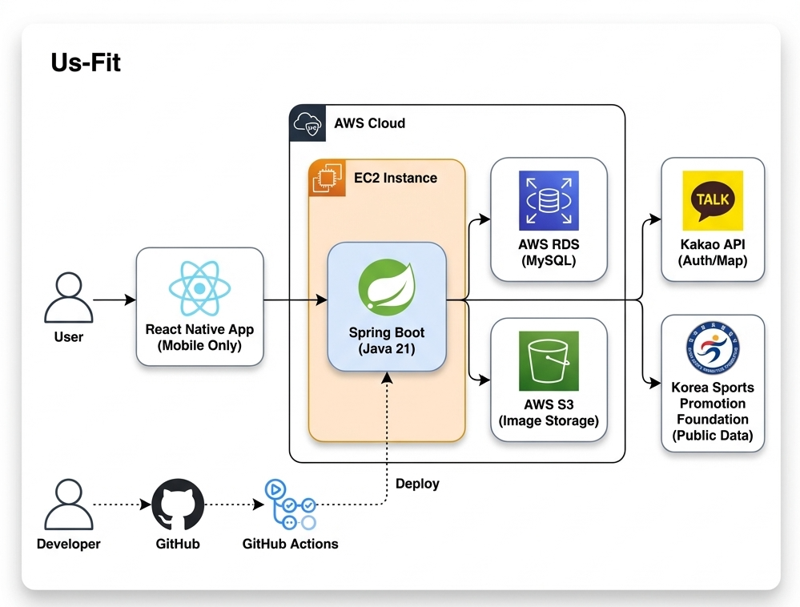
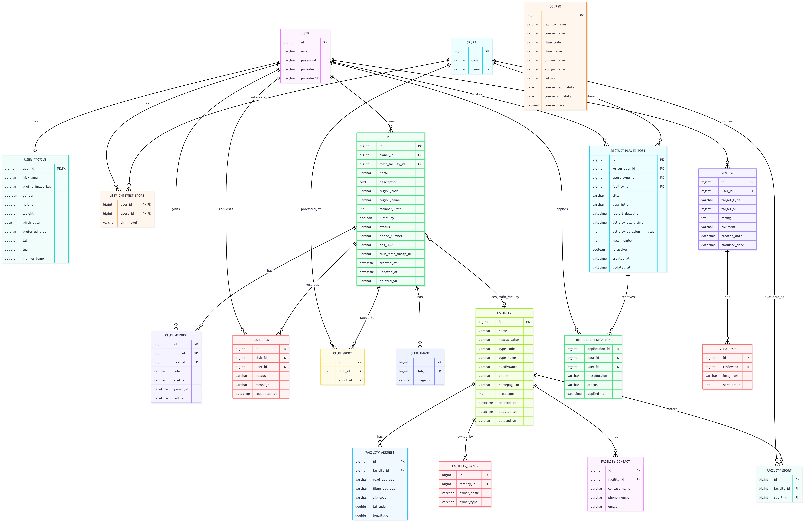

한국어 | [English](./README_ENG.md)

# UsFit - 운동으로 연결되는 우리

<div align="center">

[](https://spring.io/projects/spring-boot)
[](https://www.oracle.com/java/)
[](https://www.mysql.com/)
[](LICENSE)

**국민체육진흥공단 공공데이터를 활용한 스포츠 생활 통합 플랫폼**

스포츠 시설 정보부터 동호회·용병 매칭까지 한 번에!  
공공데이터와 커뮤니티 기능을 결합하여 대한민국 체육 활동 참여를 촉진합니다.

</div>

---

## 목차

- [프로젝트 소개](#프로젝트-소개)
- [핵심 가치](#핵심-가치)
- [주요 기능](#주요-기능)
- [공공데이터 활용](#공공데이터-활용)
- [팀 구성](#팀-구성)
- [기술 스택](#기술-스택)
- [시스템 아키텍처](#시스템-아키텍처)
- [데이터베이스 ERD](#데이터베이스-erd)
- [프로젝트 구조](#프로젝트-구조)
- [설치 및 실행](#설치-및-실행)
- [공공데이터 CSV Import](#공공데이터-csv-import)
- [API 문서](#api-문서)
- [테스트](#테스트)
- [기대 효과](#기대-효과)
- [향후 계획](#향후-계획)
- [문의 및 기여](#문의-및-기여)
- [라이선스](#라이선스)
- [감사의 말](#감사의-말)

---

## 프로젝트 소개

**UsFit**은 국민체육진흥공단이 제공하는 공공체육시설 및 강좌 데이터를 활용하여,  
개인이 운동 시설을 쉽게 찾고, 동호회에 참여하며, 용병 매칭을 통해 함께 운동할 동료를 만날 수 있는 **통합 스포츠 생활 플랫폼**입니다.

### 공모전 배경

- **활용 데이터**: 국민체육진흥공단 공공데이터포털 제공 데이터
  - 전국 공공체육시설 정보 (위치, 종목, 시설 규모 등)
  - 공공 체육강좌 정보 (프로그램명, 운영기간, 수강료 등)
- **문제 인식**: 
  - 공공 체육시설 정보가 분산되어 있어 접근성이 낮음
  - 혼자 운동하는 사람들이 동료를 찾기 어려움
  - 동호회 활동 정보가 부족하여 참여 장벽이 높음
- **해결 방안**: 공공데이터 기반 시설 검색 + 커뮤니티 기능을 결합한 올인원 플랫폼

---

## 핵심 가치

###  1. **공공데이터 접근성 향상**
국민체육진흥공단의 공공데이터를 체계적으로 정제하여 누구나 쉽게 전국의 체육시설과 강좌를 검색할 수 있습니다.

###  2.  **운동 동료 매칭**
용병 모집 시스템을 통해 필요한 인원을 빠르게 구하고, 새로운 운동 친구를 만날 수 있습니다.

### 3. **동호회 활성화**
체계적인 동호회 관리 시스템으로 회원 가입, 역할 관리, 활동 기록을 효율적으로 운영할 수 있습니다.

### 4. **지역 커뮤니티 연결**
시설 리뷰와 평가를 통해 사용자 경험을 공유하고, 지역 스포츠 문화를 활성화합니다.

---

##  주요 기능

###  **1. 공공 체육시설 검색**
- **위치 기반 검색**: 현재 위치에서 반경 N km 이내 시설 조회
- **조건별 검색**: 종목, 시/군/구, 실내/외, 시설 규모 필터링
- **상세 정보 제공**: 주소, 연락처, 면적, 지도 연동

###  **2. 공공 체육강좌 조회**
- 국민체육진흥공단 제공 강좌 데이터 검색
- 강좌명, 지역, 운영기간, 수강료 정보 제공
- 2025년 최신 강좌 정보 자동 필터링

###  **3. 동호회 커뮤니티**
- **동호회 생성 및 관리**: 동호회 설립, 소개, 활동 종목 등록
- **회원 가입 시스템**: 가입 신청/승인/거절 프로세스
- **역할 및 권한 관리**: 관리자, 일반 회원 등 역할 부여
- **회원 관리**: 탈퇴, 강퇴, 관리자 위임 기능

###  **4. 용병 매칭**
- **모집글 작성**: 날짜, 시간, 장소, 필요 인원 등록
- **신청 관리**: 신청자 목록 조회, 수락/거절
- **내 활동 조회**: 내가 작성한 모집글, 신청한 모집글 확인
- **상태 관리**: 모집 중/마감 자동 관리

###  **5. 시설 리뷰**
- **리뷰 작성**: 별점, 텍스트, 이미지 업로드 (AWS S3)
- **리뷰 조회**: 시설별, 강좌별 리뷰 목록
- **리뷰 관리**: 수정, 삭제 기능

###  **6. 회원 인증**
- **일반 회원가입/로그인**: 자체 인증 시스템
- **소셜 로그인**: Kakao OAuth 2.0 연동
- **JWT 토큰**: 보안 API 접근 제어
- **프로필 관리**: 신체정보, 관심 운동 종목 등록

---

##  공공데이터 활용

### 데이터 출처
- **제공 기관**: 국민체육진흥공단
- **데이터 형식**: CSV
- **데이터 양**: 전국 공공체육시설 14만 건, 강좌 20만 건

### 데이터 처리 프로세스

```
1. CSV 파일 수집 (국민체육진흥공단)
   ↓
2. Spring Batch로 데이터 정제 및 검증
   ↓
3. MySQL 데이터베이스에 저장
   ↓
4. REST API를 통해 서비스 제공
   ↓
5. 사용자 앱에서 실시간 검색
```

### 데이터 가공 내역

| 원본 데이터 | 가공 처리 | 활용 |
|---|---|---|
| 시설명, 주소 | 중복 제거, 좌표 변환 | 위치 기반 검색 |
| 종목 정보 | 표준화, 카테고리화 | 종목별 필터링 |
| 연락처, 홈페이지 | 형식 통일, 유효성 검증 | 사용자 정보 제공 |
| 강좌 운영기간 | 날짜 파싱, 최신 데이터 필터링 | 현재 운영 중인 강좌 조회 |

### 데이터 업데이트 전략
- **초기 적재**: `CommandLineRunner`를 통한 CSV 일괄 Import
- **정기 업데이트**: 주기적 CSV 다운로드 및 Upsert
- **중복 방지**: 시설명 + 주소 조합으로 고유키 생성

---


###  팀 구성

<table align="center">
  <tbody>
    <tr>
      <th>Team Leader</th>
      <th>Team Member</th>
      <th>Team Member</th>
      <th>Team Member</th>
    </tr>
    <tr>
      <td align="center">
        <a href="https://github.com/gitIt-sehyeon">
          
          <br />
          <b>정세현</b>
        </a>
      </td>
      <td align="center">
        <a href="https://github.com/YoonB-dev">
          
          <br />
          <b>이윤형</b>
        </a>
      </td>
      <td align="center">
        <a href="https://github.com/kimtaeyeon04">
          
          <br />
          <b>김태연</b>
        </a>
      </td>
      <td align="center">
        <a href="https://github.com/BROWNIE-TARTE">
          
          <br />
          <b>안예준</b>
        </a>
      </td>
    </tr>
    <tr>
      <td align="center">
        <a href="" target="_blank">개인 리포트</a>
      </td>
      <td align="center">
        <a href="" target="_blank">개인 리포트</a>
      </td>
      <td align="center">
        <a href="" target="_blank">개인 리포트</a>
      </td>
      <td align="center">
        <a href="" target="_blank">개인 리포트</a>
      </td>
    </tr>
  </tbody>
</table>

---

##  기술 스택

###  Backend
     

###  Database
  

###  Security & Auth
   

###  API & Docs
   

###  외부 연동
   

###  Infrastructure
   

###  Build & Tools
      

---

##  시스템 아키텍처

### 아키텍처 특징

- **3-Tier Architecture**: Presentation - Business Logic - Data Access 계층 분리
- **RESTful API**: HTTP 표준 메서드를 사용한 직관적인 API 설계
- **JWT 기반 인증**: Stateless 토큰 방식으로 확장성 확보
- **JPA/Hibernate**: 객체 지향적 데이터 접근 및 데이터베이스 독립성
- **AWS 인프라**: EC2(서버), RDS(DB), S3(스토리지) 활용한 안정적 운영

---

## 데이터베이스 ERD


**주요 엔티티:**
- **User**: 사용자 정보 및 프로필 관리
- **Club**: 동호회 생성 및 회원 관리
- **Facility**: 공공 체육시설 정보
- **Course**: 공공 체육강좌 정보
- **RecruitPlayer**: 용병 모집 및 신청
- **Review**: 시설/강좌 리뷰
- **Sport**: 종목 정보

**관계:**
- User ↔ UserProfile (1:1)
- User ↔ Club ↔ ClubMember (M:N)
- Club ↔ Sport (M:N via ClubSport)
- Facility ↔ Sport (M:N via FacilitySport)
- RecruitPlayerPost ↔ User (M:N via RecruitApplication)

---

## 프로젝트 구조

```
Us-Fit-BE/
├── src/
│   ├── main/
│   │   ├── java/app/usfit/api/
│   │   │   ├── club/                    # 동호회 도메인
│   │   │   │   ├── controller/         # 동호회 API 엔드포인트
│   │   │   │   ├── dto/               # 요청/응답 DTO
│   │   │   │   ├── entity/            # 동호회 엔티티 (Club, ClubMember, ClubJoin 등)
│   │   │   │   ├── repository/        # JPA Repository
│   │   │   │   ├── service/           # 비즈니스 로직
│   │   │   │   └── activity/                # 활동 도메인
│   │   │   │       ├── controller/        # 활동 API 엔드포인트
│   │   │   │       ├── dto/               # 요청/응답 DTO
│   │   │   │       ├── entity/            # 활동 엔티티 (Activity, ActivityMember, ActivityJoin 등)
│   │   │   │       ├── repository/        # JPA Repository
│   │   │   │       └── service/           # 비즈니스 로직
│   │   │   │
│   │   │   ├── facility/               # 체육시설 도메인
│   │   │   │   ├── controller/        # 시설 검색 API
│   │   │   │   ├── dto/               # 시설 DTO
│   │   │   │   ├── entity/            # 시설 엔티티 (Facility, FacilityAddress 등)
│   │   │   │   ├── repository/        # 시설 Repository (위치 기반 검색 쿼리 포함)
│   │   │   │   └── service/           # 시설 검색 로직 및 CSV Import
│   │   │   │
│   │   │   ├── course/                 # 체육강좌 도메인
│   │   │   │   ├── controller/        # 강좌 검색 API
│   │   │   │   ├── dto/               # 강좌 DTO
│   │   │   │   ├── entity/            # 강좌 엔티티
│   │   │   │   ├── repository/        # 강좌 Repository
│   │   │   │   └── service/           # 강좌 검색 및 CSV Import
│   │   │   │
│   │   │   ├── RecruitPlayer/          # 용병 매칭 도메인
│   │   │   │   ├── controller/        # 용병 모집 API
│   │   │   │   ├── dto/               # 용병 DTO
│   │   │   │   ├── entity/            # 용병 모집글, 신청 엔티티
│   │   │   │   ├── repository/        # 용병 Repository
│   │   │   │   └── service/           # 용병 매칭 로직
│   │   │   │
│   │   │   ├── review/                 # 리뷰 도메인
│   │   │   │   ├── controller/        # 리뷰 API
│   │   │   │   ├── dto/               # 리뷰 DTO
│   │   │   │   ├── entity/            # 리뷰 엔티티
│   │   │   │   ├── repository/        # 리뷰 Repository
│   │   │   │   └── service/           # 리뷰 관리 및 S3 업로드
│   │   │   │
│   │   │   ├── sport/                  # 종목 도메인
│   │   │   │   ├── controller/        # 종목 API
│   │   │   │   ├── dto/               # 종목 DTO
│   │   │   │   ├── entity/            # 종목 엔티티
│   │   │   │   ├── repository/        # 종목 Repository
│   │   │   │   └── service/           # 종목 관리 로직
│   │   │   │
│   │   │   ├── user/                   # 사용자 도메인
│   │   │   │   ├── controller/        # 회원 API
│   │   │   │   ├── dto/               # 회원/프로필 DTO
│   │   │   │   ├── entity/            # User, UserProfile, UserInterestSport
│   │   │   │   ├── repository/        # 회원 Repository
│   │   │   │   └── service/           # 회원 관리 로직
│   │   │   │
│   │   │   ├── oauth/                  # OAuth 인증
│   │   │   │   ├── service/           # Kakao/Google 로그인 핸들러
│   │   │   │   └── dto/               # OAuth DTO
│   │   │   │
│   │   │   ├── security/               # 보안 설정
│   │   │   │   ├── JwtAuthenticationFilter.java  # JWT 필터
│   │   │   │   ├── JwtTokenProvider.java         # JWT 생성/검증
│   │   │   │   └── SecurityConfig.java           # Spring Security 설정
│   │   │   │
│   │   │   ├── config/                 # 애플리케이션 설정
│   │   │   │   ├── SwaggerConfig.java # OpenAPI 문서 설정
│   │   │   │   ├── S3Config.java      # AWS S3 설정
│   │   │   │   └── WebConfig.java     # CORS 설정
│   │   │   │
│   │   │   ├── common/                 # 공통 유틸리티
│   │   │   │   ├── exception/         # 커스텀 예외
│   │   │   │   └── response/          # API 응답 포맷
│   │   │   │
│   │   │   └── UsFitApplication.java  # Spring Boot 메인 클래스
│   │   │
│   │   └── resources/
│   │       ├── application.properties  # 메인 설정 (DB, JWT, S3, OAuth)
│   │       ├── application-test.properties  # 테스트 환경 설정
│   │       └── static/                # 정적 리소스 (OAuth 테스트용)
│   │
│   └── test/                           # 단위/통합 테스트
│       └── java/app/usfit/api/
│
├── build.gradle                        # Gradle 빌드 스크립트 (의존성, 플러그인)
├── settings.gradle                     # Gradle 프로젝트 설정
├── gradlew, gradlew.bat                # Gradle Wrapper
└── README.md                           # 프로젝트 문서
```

---

##  설치 및 실행

###  사전 요구사항

- **JDK 21** 이상
- **MySQL 8.0** 이상
- **Gradle 8.x** (Wrapper 포함)
- **AWS 계정** (S3, RDS 사용 시)
- **Kakao Developers 계정** (OAuth 연동 시)

### 1. 데이터베이스 설정

```sql
-- MySQL 데이터베이스 생성
CREATE DATABASE UsFit CHARACTER SET utf8mb4 COLLATE utf8mb4_unicode_ci;

-- 사용자 생성 (선택사항)
CREATE USER 'usfit_user'@'localhost' IDENTIFIED BY 'your_password';
GRANT ALL PRIVILEGES ON UsFit.* TO 'usfit_user'@'localhost';
FLUSH PRIVILEGES;
```

### 2️. 환경 변수 설정

`application.properties` 또는 시스템 환경 변수로 설정:

| 환경 변수 | 설명 | 예시 |
|---|---|---|
| `DB_URL` | MySQL 접속 URL | `jdbc:mysql://localhost:3306/UsFit?useSSL=false&serverTimezone=Asia/Seoul` |
| `DB_USER` | MySQL 사용자명 | `root` 또는 `usfit_user` |
| `DB_PASS` | MySQL 비밀번호 | `your_password` |
| `JWT_SECRET` | JWT 서명 키 (Base64 인코딩 권장) | `your_secret_key_base64_encoded` |
| `JWT_ACCESS_TTL` | JWT 토큰 유효기간 (초) | `86400` (24시간) |
| `KAKAO_CLIENT_ID` | Kakao REST API 키 | `your_kakao_rest_api_key` |
| `KAKAO_CLIENT_SECRET` | Kakao Client Secret | `your_kakao_client_secret` |
| `KAKAO_REDIRECT_URI` | Kakao 리다이렉트 URI | `http://localhost:8080/oauth2/callback/kakao` |
| `AWS_S3_BUCKET` | S3 버킷 이름 | `usfit-s3-bucket` |
| `AWS_REGION` | AWS 리전 | `ap-southeast-2` |
| `AWS_ACCESS_KEY_ID` | AWS Access Key | `your_aws_access_key` |
| `AWS_SECRET_ACCESS_KEY` | AWS Secret Key | `your_aws_secret_key` |

### 3️. 애플리케이션 실행

#### Windows (cmd)
```cmd
gradlew.bat clean build
gradlew.bat bootRun
```

#### Linux/Mac
```bash
./gradlew clean build
./gradlew bootRun
```

### 4️. 서버 확인

- 서버 주소: `http://3.27.134.2:8080`
- Swagger UI: `http://3.27.134.2:8080/swagger-ui/index.html#`

---

##  공공데이터 CSV Import

국민체육진흥공단 공공데이터를 데이터베이스에 적재하는 방법:

### 시설 데이터 Import

```java
// FacilityImportService 사용 예시
@Autowired
private FacilityImportService facilityImportService;

// CSV 파일 경로로 import
Path csvPath = Paths.get("path/to/facility_data.csv");
facilityImportService.importCsv(csvPath, true, StandardCharsets.UTF_8);
```

**주요 기능:**
- 중복 방지: 시설명 + 도로명주소 키로 upsert
- 자동 매핑: CSV 헤더 기반 필드 매핑
- 좌표 변환: 위도/경도 자동 파싱

### 강좌 데이터 Import

```java
// CourseImportService 사용 예시
@Autowired
private CourseImportService courseImportService;

// CSV 파일 경로로 import
Path csvPath = Paths.get("path/to/course_data.csv");
courseImportService.importCsv(csvPath, true, StandardCharsets.UTF_8);
```

**주요 기능:**
- 최신 데이터 필터링: 2025년 강좌만 적재
- 배치 처리: 1000건씩 Batch Insert로 성능 최적화
- 자동 매핑: 강좌명, 운영기간, 수강료 등 자동 파싱

### CommandLineRunner로 초기 데이터 로드

```java
@Bean
@Profile("dev")
CommandLineRunner initData(FacilityImportService facilityService, 
                          CourseImportService courseService) {
    return args -> {
        facilityService.importCsv(Paths.get("data/facilities.csv"), true, StandardCharsets.UTF_8);
        courseService.importCsv(Paths.get("data/courses.csv"), true, StandardCharsets.UTF_8);
        log.info("공공데이터 초기 로드 완료");
    };
}
```

---

## API 문서

### Swagger UI 접속

서버 실행 후 아래 주소로 접속:

```
http://3.27.134.2:8080/swagger-ui/index.html#
```

### 주요 API 엔드포인트

#### 시설 API
- `GET /api/facility/{id}` - 시설 상세 조회
- `GET /api/facility/search` - 조건별 시설 검색 (종목, 지역 등)
- `GET /api/facility/nearby` - 위치 기반 시설 검색 (반경 N km)

#### 강좌 API
- `GET /api/course/search` - 강좌 검색 (강좌명, 지역)

#### 동호회 API
- `POST /api/clubs` - 동호회 생성
- `GET /api/clubs` - 동호회 목록 조회
- `POST /api/club/{id}/requests` - 가입 신청
- `POST /api/club/join/requests/{id}/decision` - 가입 승인/거절
- `GET /api/club-info/{id}` - 동호회 상세 정보
- `PATCH /api/club-info/{id}/member/{memberId}` - 회원 역할 변경

#### 동호회 활동 API
- `POST /api/clubs/{clubId}/activities` - 활동 생성
- `GET /api/clubs/{clubId}/activities` - 활동 목록 조회
- `POST /api/clubs/{clubId}/activities/{activityId}/join` - 활동 참여
- `GET /api/clubs/{clubId}/activities/{activityId}/members` - 활동 멤버 리스트 조회
- `POST /api/clubs/{clubId}/activities/members/{activityMemberId}/status` - 활동 멤버 상태 변경

#### 용병 모집 API
- `POST /api/recruits` - 용병 모집글 작성
- `GET /api/recruits` - 모집글 목록 조회
- `GET /api/recruits/me` - 내가 작성한 모집글
- `POST /api/recruits/{postId}/applications` - 용병 신청
- `PATCH /api/recruits/applications/{applicationId}` - 신청 상태 변경
- `GET /api/recruits/applications/me` - 내가 신청한 용병 목록

#### 리뷰 API
- `POST /api/review` - 리뷰 작성 (이미지 업로드 포함)
- `GET /api/review` - 리뷰 목록 조회
- `PUT /api/review/{id}` - 리뷰 수정
- `DELETE /api/review/{id}` - 리뷰 삭제

#### 회원 API
- `POST /api/user/signup` - 회원가입
- `POST /api/user/login` - 로그인 (JWT 토큰 발급)
- `GET /api/user/profile` - 프로필 조회
- `POST /api/user/profile` - 프로필 등록/수정
- `GET /api/oauth/kakao` - Kakao 로그인

### JWT 인증 테스트

1. `/api/user/login`으로 로그인하여 JWT 토큰 획득
2. Swagger UI 우측 상단 `Authorize` 버튼 클릭
3. `Bearer {token}` 형식으로 입력 (Bearer 뒤에 공백 필수)
4. 인증이 필요한 API 테스트

---

## 테스트

### 테스트 실행

```cmd
gradlew.bat test
```

### 테스트 커버리지 확인

```cmd
gradlew.bat jacocoTestReport
```

보고서 위치: `build/reports/jacoco/test/html/index.html`

---

## 기대 효과

### 사회적 가치

1. **공공데이터 활용 확대**
   - 국민체육진흥공단 데이터의 접근성을 높여 공공 자산의 활용도 증대
   - 체육시설 정보의 민주화로 누구나 쉽게 시설 정보 접근 가능

2. **건강한 운동 문화 조성**
   - 동호회 활동 활성화로 지역 커뮤니티 연결
   - 용병 매칭으로 1인 운동자들의 팀 스포츠 참여 기회 확대

3. **공공체육시설 이용률 증가**
   - 시설 정보 검색 편의성 향상으로 공공시설 활용도 상승
   - 리뷰 시스템을 통한 시설 품질 개선 피드백

### 기술적 가치

1. **확장 가능한 아키텍처**
   - 마이크로서비스 전환 가능한 도메인 중심 설계
   - RESTful API로 다양한 클라이언트(웹, 모바일) 지원

2. **데이터 기반 의사결정**
   - 사용자 활동 데이터 분석을 통한 서비스 개선
   - 지역별, 종목별 수요 분석 가능

3. **오픈 플랫폼 가능성**
   - OpenAPI(Swagger) 제공으로 외부 개발자 연동 지원
   - 공공 API로 확장 시 타 서비스와 협력 가능

---

## 향후 계획

- [ ] **AI 기반 추천 시스템**: 사용자 선호도 기반 시설/동호회 추천
- [ ] **실시간 알림**: FCM을 활용한 동호회 활동, 용병 매칭 알림
- [ ] **결제 시스템 연동**: 동호회 회비, 시설 예약 결제 기능
- [ ] **채팅 기능**: 동호회 내부 채팅방, 용병 매칭 1:1 채팅
- [ ] **통계 대시보드**: 관리자용 사용자/시설 통계 시각화
- [ ] **다국어 지원**: 외국인을 위한 영어, 중국어 등 다국어 서비스

---

## 문의 및 기여

### 프로젝트 관련 문의
- 이슈 등록: [GitHub Issues](https://github.com/Us-Fit/Us-Fit-BE/issues)
- 이메일: 팀 대표 이메일 주소

### 기여 방법
1. Fork the Project
2. Create your Feature Branch (`git checkout -b feature/AmazingFeature`)
3. Commit your Changes (`git commit -m 'Add some AmazingFeature'`)
4. Push to the Branch (`git push origin feature/AmazingFeature`)
5. Open a Pull Request

---

## 라이선스

이 프로젝트는 MIT 라이선스 하에 배포됩니다. 자세한 내용은 `LICENSE` 파일을 참조하세요.

---

## 감사의 말

- **국민체육진흥공단**: 양질의 공공 체육시설 데이터 제공
- **Kakao Developers**: Kakao Map API 및 OAuth 서비스 제공
- **AWS**: 클라우드 인프라 지원
- **Spring Community**: 훌륭한 프레임워크와 문서 제공

---

<div align="center">

**UsFit - 운동으로 연결되는 우리, 함께 만들어가는 건강한 대한민국 **

Made with ❤️ by Us-Fit Team

</div>
