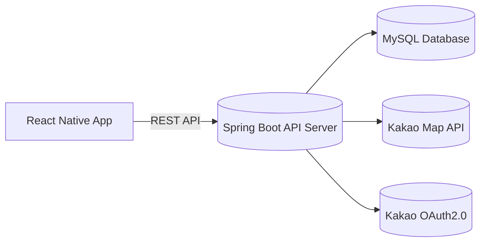

# 🏋️‍♂️ UsFit – 운동으로 연결되는 우리    

> **스포츠 시설 정보부터 동호회·용병 매칭까지 한 번에!**  
> 체육활동 참여를 촉진하고 운동을 통해 사람을 연결하는 통합 스포츠 플랫폼

---

## 📱 주요 화면 (Screenshots)
(앱 주요 화면 캡처 추가 예정)

---

## 팀 구성

<table align="center">
  <tbody>
    <tr>
      <th>Team Leader</th>
      <th>Team Member</th>
      <th>Team Member</th>
      <th>Team Member</th>
    </tr>
    <tr>
      <td align="center">
        <a href="https://github.com/gitIt-sehyeon">
          
           
          <b>정세현</b>
        </a>
      </td>
      <td align="center">
        <a href="https://github.com/YoonB-dev">
          
           
          <b>이윤형</b>
        </a>
      </td>
      <td align="center">
        <a href="https://github.com/kimtaeyeon04">
          
           
          <b>김태연</b>
        </a>
      </td>
      <td align="center">
        <a href="https://github.com/BROWNIE-TARTE">
          
           
          <b>안예준</b>
        </a>
      </td>
    </tr>
    <tr>
      <td align="center">
        <a href="" target="_blank">개인 리포트</a>
      </td>
      <td align="center">
        <a href="" target="_blank">개인 리포트</a>
      </td>
      <td align="center">
        <a href="" target="_blank">개인 리포트</a>
      </td>
      <td align="center">
        <a href="" target="_blank">개인 리포트</a>
      </td>
    </tr>
  </tbody>
</table>

## 📖 프로젝트 개요 (Overview)

**UsFit**은 전국 체육시설 정보를 기반으로 사용자가  
- 운동할 시설을 쉽게 찾고,  
- 함께 운동할 사람(동호회·용병)을 연결하며,  
- 위치 기반으로 실시간 소통할 수 있도록 돕는 **체육활동 종합 플랫폼**입니다.

> 🎯 **목표:** 체육활동 접근성을 높이고, 개인 → 커뮤니티 → 지역사회로 이어지는 건강한 운동 문화 확산

---

## 🚀 주요 기능 (Features)

| 구분 | 기능 | 설명 |
|------|------|------|
| 🏟 **시설 정보 검색** | 종목(sport) + 지역(시/군/구) 기반 | 공공데이터 기반 체육시설 정보(이름, 주소, 종목 등) 제공 |
| 🗺 **카카오맵 연동** | 지도 기반 위치 제공 | 시설, 동호회, 용병 모집글 위치를 카카오맵 API로 시각화 |
| 💬 **동호회 커뮤니티** | 게시판 & 그룹 관리 | 종목별 동호회 개설, 모집글, 댓글 및 참여 관리 |
| ⚔ **용병 기능** | 운동 파트너 매칭 | 종목·시간·위치 기반 용병 모집 및 참여 기능 |
| 🔐 **로그인/회원 관리** | 자체 로그인 & 카카오 로그인 | JWT 기반 인증, Kakao OAuth2.0 연동 |
| 🏋 **체육활동 추진 목표** | 개인 → 커뮤니티 → 시설 이용 확장 | 국민 체육활동 참여 확대 및 운동 네트워크 구축 |

---

## 🏗 시스템 아키텍처 (Architecture)

## 🧩 기술 스택 (Tech Stack)

### 🎨 Frontend
    

### 🖥 Backend
  

### 🗄 Database
  

### 🌐 API 연동
  

### ☁️ Infra (예정)
  

### ⚙️ Tools
    

## 🗂 데이터 구조 (Entity / DB)

주요 엔티티

- User : 사용자 정보 (이메일, 닉네임, 프로필 등)

- Sport : 종목 코드 및 이름

- Facility : 시설명, 주소, 종목, 연락처

- Club : 동호회 (게시글, 참여자, 댓글)

- RecruitPlayer : 용병 모집글 (위치, 시간, 인원)

## 💡 ERD
(예시)

## 💡 개발 동기 및 기대 효과 (Motivation)
💭 문제 인식
공공 체육시설 정보가 여러 플랫폼에 흩어져 있어 접근이 어렵다.

함께 운동할 사람을 찾을 수 있는 체계적인 서비스가 부족하다.

## 💡 해결 방법
공공데이터 기반 시설 정보 제공 +
동호회 및 용병 커뮤니티 기능으로 사용자를 연결

## 🏆 기대 효과
지역 체육시설 이용률 증가

운동 참여 커뮤니티 확산

지속 가능한 체육활동 네트워크 형성

